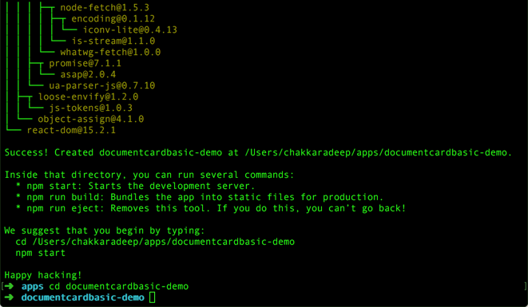
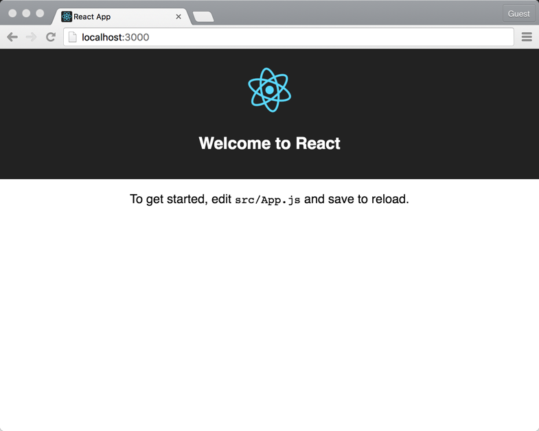
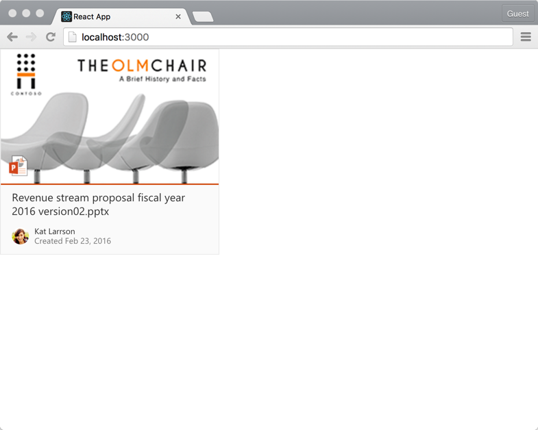

## Configuring Your Environment

To get started, we highly recommend having the following tools installed:

* [Visual Studio Code](https://code.visualstudio.com/)
* [Node.js](https://nodejs.org/en/) (NOTE: please install the LTS version as we can't validate current will always work)
* [git](https://git-scm.com/)

### Verify your environment works

Open a command line and run these:

* Run `node -v` to check your node version! It should probably be 6.x.x.

* Run `npm -v` to check your npm version. If your version is below 5.x.x, run `npm install -g npm` to update it.

* Go to a folder and run `code .` to open VSCode in a folder. If you don't have VSCode in your path, you can open VSCode and press f1, type `path`, and select the `Install 'code' command in PATH` option.

* Run `git --version` to make sure you have git.

### Creating a simple app

#### Overview
In this tutorial, let's build a simple React app with an Office UI Fabric React DocumentCard.

#### Prerequisites

##### Node.js and npm

Install [Node.js and npm](https://nodejs.org/en/) if you haven't already installed in your machine. It is recommended you at least install node `version 4.x.x` and npm `version 3.x.x`.

>You can check your node and npm version by running `node -v` and `npm -v` respectively.

##### create-react-app package

We will use [Create React App](https://facebook.github.io/react/blog/2016/07/22/create-apps-with-no-configuration.html) to quickly create a React app for this tutorial.

Once node and npm is installed, type the following command in a console to install the `create-React-app` npm package.

```
npm install -g create-react-app
```

##### Visual Studio Code
Download and install [Visual Studio Code](https://code.visualstudio.com/).

>We will use Visual Studio Code as our code editor for this tutorial. Feel free to use your favorite code editor of choice if you do not want to use Visual Studio Code.

#### Step 1: Create react app
In a console, type the following command to create a simple React app.

```
create-react-app documentcardbasic-demo
```

This will install the required depedencies and scaffold a simple React app.



Once its complete, navigate to the `documentcardbasic-demo` folder.

```
cd documentcardbasic-demo
```

Type the following command to launch the React app in your browser.

```
npm start
```



#### Step 2: Install office-ui-fabric-react package
To use Fabric React in your project, you will need to first install the `office-ui-fabric-react` npm package. Type the following in the console to install the package:

```
npm install office-ui-fabric-react --save
```

>If you have `npm start` command still running, terminate the command by pressing `Ctrl+C`.

#### Step 3: Add DocumentCardBasic component
Open the `documentcardbasic-demo` project folder in Visual Studio Code.

Open the file `src\App.js` and replace the existing code inside `render` method to only return the `DocumentCard` component:

```jsx
<DocumentCard onClickHref='http://bing.com'>
  <DocumentCardPreview
    previewImages={ [
      {
        previewImageSrc: require('./documentpreview.png'),
        iconSrc: require('./iconppt.png'),
        width: 318,
        height: 196,
        accentColor: '#ce4b1f'
      }
    ] }
  />
  <DocumentCardTitle title='Revenue stream proposal fiscal year 2016 version02.pptx'/>
  <DocumentCardActivity
    activity='Created Feb 23, 2016'
    people={
      [
        { name: 'Kat Larrson', profileImageSrc: require('./avatarkat.png') }
      ]
    }
    />
</DocumentCard>
```

`DocumentCard` component contains the `DocumentCardPreview`, `DocumentCardTitle` and `DocumentCardActivity` components that help you describe the document card.

Since `office-ui-fabric-react` is a npm module, we will need to import the document card component in the `App` component.

Add the following import statement at the top of the `src\App.js` file just below `import './App.css'`:

```js
import {
  DocumentCard,
  DocumentCardPreview,
  DocumentCardTitle,
  DocumentCardActivity
} from 'office-ui-fabric-react/lib/DocumentCard';
```

Notice how we import only the specific component module from `lib` folder instead of importing the entire `office-ui-fabric-react` module.

Save the `src\App.js` file.

Below is an example of how you can similarly import other components:

```js
import { DefaultButton, PrimaryButton } from 'office-ui-fabric-react/lib/Button';
```

Open `index.html` file.

Fabric React components provide support for Left-to-Right (LTR) and Right-to-Left (RTL) rendering out of the box.

You can specify the default direction in your `index.html`. Add the `dir` attribute with the value `ltr` to the `<html>` element:

```html
<html lang="en" dir="ltr">
```

Load Office UI Fabric styles by linking to the Office UI Fabric CDN. Add the following to the `<head`> element:

```html
<link rel="stylesheet" href="https://static2.sharepointonline.com/files/fabric/office-ui-fabric-core/9.0.0/css/fabric.min.css">
```

Save the file.

Copy the following images from GitHub to `src` folder.
* [avatarkat.png](./images/avatarkat.png)
* [iconppt.png](./images/iconppt.png)
* [documentpreview.png](./images/documentpreview.png)

#### Step 4: Preview document card
Switch to the console and type the following to preview your app in the browser:

```
npm start
```

You should see the document card component in your app.



#### Next steps
Congratulations! You have successfully built a simple React app with an Office UI Fabric React DocumentCard.

As next steps, try using other components like `DetailsLists`, `Callout` etc.,

### The Fabric Component

Consumers using Fabric components should be wrapping their content within the Fabric component.

```tsx
import { Fabric } from 'office-ui-fabric-react/lib/Fabric';
import * as React from 'react';
import * as ReactDOM from 'react-dom';


ReactDOM.render(
  <Fabric>
    <App/>
  </Fabric>,
  element);
```

* Note: The Fabric component will render a div, and will mix in div properties. You may use it as a replacement for a root div.

The Fabric component is a root wrapper component which solves 2 problems:

1. The default fontFamily css style is defined at this layer, allowing components within to inherit the default fontFamily. The class `ms-Fabric` defines this.

2. The focus rectangle visibility is managed through the `is-focusVisible` css class.

#### Focus rectangle notes

Focus rectangles around components should only be shown when the user presses tab or directional keys. When they press mouse buttons, focus rectangles should not be shown. The `Fabric` component that will conditionally add/remove an `is-focusVisible` class, and components rendering focus rectangles should conditionalize their visibility based on the `.ms-Fabric.is-focusVisible` parent selector.

This is abstracted in the scss include `focus-border()`.

### Using Icons

By default, the Fabric icons are not added to your bundle, in order to save bytes for scenarios where you don't care about icons, or you only care about a subset.

To make them available, you may initialize them as such:

```tsx
import { initializeIcons } from 'office-ui-fabric-react/lib/Icons';

initializeIcons(/* optional base url */);
```

#### Alternative CDN options

By default, the icon font will be pulled from the SharePoint CDN.

If you would like the icons to be served from your cdn, simply copy the files from the package's `fonts` folder to your cdn, and in `initializeIcons`, provide the base url to access those fonts (Note that it will require a trailing slash.)

#### What does `initializeIcons` do?

It registers a map of icon names, which define how to render icons. Icons can be rendered either through JSX components, or as a font character. The icon code will register the font-face definition only when a given icon from a subset is referenced.

What we're trying to optimize here is download size. We define a map of icon codes which map to a font-face. When the `Icon` component renders the `Upload` icon, we determine if the font-face has yet been registered, an if not, we add it to the page, causing the subset containing the `Upload` icon to be downloaded.

The `@uifabric/icons` packages can resolve over 1000 different icons, and will download from the 10+ font partitions, minimizing download overhead. We also include the most common icons in the first partition, optimizing for the basic scenarios. If there are commonly used icons missing in there, please file an issue so that we can evaluate adjusting the primary partition.

#### Disabling generated warnings

When icons are rendered using the `Icon` component, but have not yet been registered, you will see console errors indicating so. In most cases, this can be addressed by registering the icons. But there are 2 cases, where this isn't desirable:

**Test scenarios**

In test scenarios, you may want to simply disable the warnings and avoid registering icons. To do this:

```tsx
import { setIconOptions } from 'office-ui-fabric-react/lib/Styling';

// Suppress icon warnings.
setIconOptions({
  disableWarnings: true
});
```

**Library icon registration**

If your code is running in an environment where icons may have already been registered, you may need to disable the warnings. (By default, registering the same icon twice will ignore subsequent registrations.) To initialize icons and avoid duplication warnings, pass options into `initializeIcons`:

```tsx
import { initializeIcons } from '@uifabric/icons';

initializeIcons(undefined, { disableWarnings: true });
```

### Using componentRef instead of ref

React exposes a special `ref` prop for components. If you use `ref` on an intrinsic elements such as divs or spans, React will give you a reference to the element, allowing you access to the public API for the elements.

Using `ref` to access component public methods is more error prone:

1. If the component wraps itself in a higher order component or decorator, the `ref` will return the wrapper component rather than what you intended to access.

2. Accessing the full component's public methods is probably not desirable. It isn't exactly intended to access `public render` or to allow the consumer to call `componentWillUnmount`, despite these being publicly exposed to React.

#### Consuming a component's public API

There ARE limited cases where a component should expose a public API contract. Usually, things can be more declarative in React, but some scenarios which are perhaps easier to do imperatively are:

1. Exposing a `focus` method.
2. Accessing current values of uncontrolled prop values (such as the current value of a `TextField`.)

In Fabric, we do the following for components which expose an imperative API surface:

1. Define an `I{ComponentName}` interface which only exposes the methods intended to be supported.
2. Every component supports a `componentRef` prop, which will return the `I{ComponentName}` interface if provided.

So, use `componentRef` as a drop-in replacement for `ref`.

Example usage of `componentRef` to access the `IButton` interface:

```tsx
private _primaryButton: IButton = React.createRef<IButton>();

public render() {
  return <PrimaryButton componentRef={ this._primaryButton } ... />;
}

public componentDidMount() {
  this._primaryButton.value.focus();
}
```

#### In Fabric, extend `BaseComponent` to abstract resolving the componentRef

If your component extends `BaseComponent`, the `componentRef` will be auto-resolved for you and you just need to focus on exposing it in the prop typings.

If you were to write a component which extended vanilla `React.Component`, you would need to resolve it manually. For example, on mount:

```tsx
public componentDidMount() {
  const { componentRef } = this.props;
  componentRef && componentRef(this);
}
```

...and clear it on unmount:

```tsx
public componentWillUnmount() {
  const { componentRef } = this.props;
  componentRef && componentRef(undefined);
}
```

